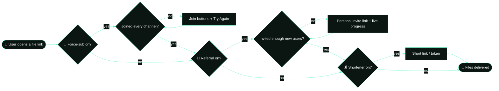

<!-- ⚡ TRINITY MODS · FILE STORE BOT — github.com/Trinity-Mods/File-Store-Bot -->

<p align="center">
  
</p>

<h1 align="center">File Store Bot</h1>

<p align="center">
  <b>Store · Link · Protect · Grow · Monetize</b><br>
  The all-in-one Telegram file store bot by <b>Trinity Mods</b>
</p>

<p align="center">
  
</p>

<p align="center">
  
  
  
  
  
</p>

<p align="center">
  <a href="https://t.me/trinityXmods"></a>
  <a href="https://github.com/Trinity-Mods"></a>
  <a href="https://github.com/Trinity-Mods/File-Store-Bot/stargazers"></a>
  
</p>

<p align="center">
  <a href="#-whats-new-in-v20">What's new</a> •
  <a href="#-features">Features</a> •
  <a href="#-access-modes">Access modes</a> •
  <a href="#-deploy">Deploy</a> •
  <a href="#-configuration">Configuration</a> •
  <a href="#-commands">Commands</a> •
  <a href="#-project-structure">Structure</a> •
  <a href="#-troubleshooting">Help</a>
</p>

---

## 🤖 About

**File Store Bot** turns any file into a private Telegram link. Admins send files to the bot, the bot
stores them in a private channel, and users who open the link get the file — after they join your channels,
invite friends, or pass your shortener, depending on how you set it up.

It's beginner-friendly (deploy in minutes, configure everything from one file) and built to handle real
traffic: atomic database operations, background auto-delete, and membership checks that don't break under load.

---

## 🆕 What's new in v2.0

| | Change |
| --- | --- |
| 📢 | **Optional force-sub** — use **0, 1, 2, 3 or 4** channels/groups. Empty slots are simply skipped. |
| 👥 | **Referral system** — users unlock files by inviting **new** users with a personal link. Fresh accounts only, counted exactly once, with live progress notifications. |
| 🔁 | **Dual mode** — force-sub first, then referrals, then files. Or run either one alone. |
| ⚙️ | **`/settings` panel** — the owner switches modes, the referral goal and the unlock time **live from Telegram**. |
| 🖼️ | **Start image** — send a picture with `/start` (link, file_id or repo file). Optional pictures for the force-sub and referral screens too. |
| ✅ | **Force-sub fix** — members who joined every channel are no longer shown the join message again (details in [Troubleshooting](#-troubleshooting)). |
| 🔄 | **Smart "Try Again"** — the join screen lists only the channels still missing and sends the requested file right after joining. |
| ⏳ | **Auto-delete that survives restarts** — runs in the background, plus a "♻️ Get files again" button. |
| 🧰 | **Latest stack** — Python 3.13, Pyrofork 2.3 (built-in conversations), PyMongo async, `.env` support, cleaner dependencies. |
| 🛡️ | **Many fixes** — `/add_admin` admins now work everywhere, FloodWait handling, one-time verify tokens, batch shortener links under Telegram's 64-character limit, owner-only `/admins` list, and more. |

> ♻️ **Upgrading from v1?** Your old links, users, admins, premium members and environment variables keep working.
> Just redeploy (or run `pip install -r requirements.txt` again on a VPS).

---

## ✨ Features

| | Feature |
| --- | --- |
| 🔗 | Private share links for single files or whole **batches** (`/genlink`, `/batch`) |
| 📢 | Force-sub with **0 – 4** channels or groups (IDs or @usernames) |
| 👥 | **Referral** unlocking — lifetime or time-limited, with a top-referrers leaderboard |
| 🔁 | **Dual mode**: force-sub ➜ referral ➜ files |
| ⚙️ | Live owner **control panel** (`/settings`) |
| 🖼️ | **Start / force-sub / referral pictures** with random rotation |
| 🔒 | Anti-forward / anti-save protection (`PROTECT_CONTENT`) |
| 📝 | Custom captions with `{filename}` and `{previouscaption}` |
| ⏳ | Auto-delete timer with a re-fetch button |
| 💰 | Shortener earnings — per-link or token verification |
| 💎 | Premium plans with UPI / QR — premium users skip the shortener **and** referrals |
| 📣 | Broadcasts with live progress |
| 🐳 | Docker, Heroku, Koyeb, Railway, Render or any VPS |

---

## 🔐 Access modes

Pick one with `ACCESS_MODE` in the config — or switch at any time with **`/settings`** in Telegram.

| Mode | What users must do before getting files |
| --- | --- |
| `fsub` *(default)* | Join your force-sub channels (if you set any) |
| `referral` | Invite `REFERRAL_COUNT` new users with their personal link |
| `dual` | Join the channels **first**, then complete the referrals |
| `off` | Nothing — open access |



**Who skips what:** admins skip every step · premium users skip the referral and shortener steps.
When a step stops someone, the bot remembers the link they opened and sends it the moment they finish.

### 👥 How referrals are counted

1. Every user gets a link like `https://t.me/YourBot?start=ref_123456789` (via the referral screen or `/refer`).
2. A referral counts **only** for people who have **never used the bot before** — old users, self-referrals,
   scam/fake accounts and links of unknown users are ignored.
3. In **dual** mode the invited person must also **join your channels** before it counts.
4. Each new user can be counted **once** — even if they tap the link many times at the same moment.
5. The referrer gets a live notification with a progress bar, and a **📥 Get your file** button when they hit the goal.

| Setting | Effect |
| --- | --- |
| `REFERRAL_COUNT=3` | Users must invite 3 new users |
| `REFERRAL_EXPIRE=0` | Reaching the goal unlocks files **forever** |
| `REFERRAL_EXPIRE=86400` | Each goal unlocks files for **24 hours** and uses up 3 referrals, so users keep inviting |

### 🖼️ Start picture

Set `START_PIC` to any of these:

| Type | Example |
| --- | --- |
| Direct image link | `https://telegra.ph/file/abc123.jpg` (telegra.ph, envs.sh, imgbb, GitHub raw …) |
| Telegram file_id | `AgACAgUAAxkBAAI…` |
| Image in the repo | `assets/start.jpg` |
| Several (random) | `https://…/one.jpg https://…/two.jpg` |

A ready-made Trinity Mods picture is included:
`https://raw.githubusercontent.com/Trinity-Mods/File-Store-Bot/main/assets/start.jpg`

The same formats work for `FORCE_PIC` and `REFERRAL_PIC`. If a picture can't be sent, the bot simply sends
the text — `/start` never breaks. Telegram allows **1024 characters** under a picture; longer texts are sent without it.

---

## 🚀 Deploy

<p align="center">
  <a href="https://heroku.com/deploy?template=https://github.com/Trinity-Mods/File-Store-Bot"></a>
  &nbsp;
  <a href="https://app.koyeb.com/deploy?type=git&repository=github.com/Trinity-Mods/File-Store-Bot&branch=main&name=file-store-bot"></a>
  &nbsp;
  <a href="https://railway.app/new/template/1jKLr4"></a>
  &nbsp;
  <a href="https://render.com/deploy"></a>
</p>

### ✅ Before you deploy

1. Create a bot with [@BotFather](https://t.me/BotFather) and copy the **token**.
2. Get your **API ID** and **API hash** from [my.telegram.org/apps](https://my.telegram.org/apps).
3. Create a **private channel** for storage, add the bot as **admin**, and copy its ID (starts with `-100`).
4. Create a free **MongoDB** cluster on [MongoDB Atlas](https://www.mongodb.com/atlas), copy the connection URL,
   and under *Network Access* allow `0.0.0.0/0`.
5. *(Optional)* Add the bot as **admin** to each force-sub channel with the **Invite users via link** permission.

### 🐳 Docker

```bash
git clone https://github.com/Trinity-Mods/File-Store-Bot.git
cd File-Store-Bot
cp .env.example .env        # then fill in your values
docker build -t file-store-bot .
docker run -d --name file-store-bot --env-file .env --restart unless-stopped file-store-bot
```

### 🖥️ VPS / PC

```bash
git clone https://github.com/Trinity-Mods/File-Store-Bot.git
cd File-Store-Bot
python3 -m venv venv && source venv/bin/activate
pip install -r requirements.txt
cp .env.example .env        # then fill in your values
python3 main.py
```

> 💡 The bot runs a tiny web server on `PORT` (default `8080`). Hosting platforms use it as a health check —
> on free tiers that sleep, point an uptime monitor at your app URL to keep it awake.

---

## 🔧 Configuration

Set these as **environment variables**, in a **`.env`** file, or directly in **[`config.py`](config.py)**
(every option is explained there). On/off values accept `TRUE` / `FALSE`.

<details open>
<summary><b>🔴 Required</b></summary>

| Variable | Description |
| --- | --- |
| `TG_BOT_TOKEN` | Bot token from [@BotFather](https://t.me/BotFather) |
| `APP_ID` · `API_HASH` | From [my.telegram.org/apps](https://my.telegram.org/apps) |
| `CHANNEL_ID` | Private database channel ID (`-100…`), bot must be admin |
| `OWNER_ID` | Your Telegram user ID |
| `DB_URL` | MongoDB connection URL |
| `DB_NAME` | Database name — default `FileStoreBot` |

</details>

<details open>
<summary><b>🔐 Access, force-sub & referrals</b></summary>

| Variable | Default | Description |
| --- | --- | --- |
| `ACCESS_MODE` | `fsub` | `fsub` · `referral` · `dual` · `off` |
| `FORCE_SUB_CHANNEL` … `FORCE_SUB_CHANNEL4` | *empty* | Up to 4 chats (`-100…` ID or `@username`). Leave unused slots empty |
| `FORCE_MSG` | *built-in* | Text above the join buttons |
| `FORCE_PIC` | *empty* | Optional picture for the force-sub message |
| `REFERRAL_COUNT` | `3` | New users each person must invite |
| `REFERRAL_EXPIRE` | `0` | Seconds of access per goal (`0` = forever) |
| `REFERRAL_MSG` | *built-in* | Text on the referral screen |
| `REFERRAL_SHARE_TEXT` | *built-in* | Text pre-filled when users share their link |
| `REFERRAL_PIC` | *empty* | Optional picture for the referral screen |

</details>

<details>
<summary><b>🏠 Start message, files & admins</b></summary>

| Variable | Default | Description |
| --- | --- | --- |
| `START_MESSAGE` | *built-in* | The `/start` text (`START_MSG` also works) |
| `START_PIC` | *empty* | Start picture — link, file_id or repo path; several = random |
| `CUSTOM_CAPTION` | *Trinity Mods credit* | Caption for delivered files (`none` keeps originals) |
| `PROTECT_CONTENT` | `FALSE` | Block forwarding / saving of delivered files |
| `TIME` | `600` | Auto-delete delivered files after N seconds (`0` = never) |
| `DISABLE_CHANNEL_BUTTON` | `TRUE` | Hide the "Share URL" button under DB-channel posts |
| `ADMINS` | *empty* | Extra admin IDs, separated by spaces |
| `OWNER_TAG` | `the_universal_being` | Your public username (support & payments) |
| `USER_REPLY_TEXT` | *built-in* | Reply to users who message the bot (`none` = silent) |
| `BOT_STATS_TEXT` | *built-in* | `/stats` text with `{uptime}` |

</details>

<details>
<summary><b>💰 Shortener & 💎 premium</b></summary>

| Variable | Default | Description |
| --- | --- | --- |
| `USE_SHORTLINK` | `FALSE` | Turn on shortener earnings |
| `SHORTLINK_API_URL` · `SHORTLINK_API_KEY` | `gplinks.com` · *empty* | Your shortener and API key |
| `U_S_E_P` | `TRUE` | `TRUE` = every link is shortened · `FALSE` = token verification |
| `VERIFY_EXPIRE` | `43200` | How long a verified token lasts (seconds) |
| `TUT_VID` | *Trinity tutorial* | "How to download / verify" link |
| `USE_PAYMENT` | `TRUE` | Show premium plans (needs `USE_SHORTLINK`) |
| `UPI_ID` · `UPI_IMAGE_URL` | — | Payment details & QR image |
| `PRICE1` … `PRICE5` | `₹200` … `₹2850` | 7 days · 1 month · 3 months · 6 months · 1 year |

</details>

<details>
<summary><b>🛠️ Advanced</b></summary>

| Variable | Default | Description |
| --- | --- | --- |
| `PORT` | `8080` | Health-check web server port |
| `TG_BOT_WORKERS` | `50` | Updates handled at the same time |

</details>

**Placeholders** you can use in texts: `{first}` `{last}` `{username}` `{mention}` `{id}` — plus
`{required}` `{count}` `{remaining}` in `REFERRAL_MSG`. Write `\n` for a new line in environment variables.

---

## 📜 Commands

| For | Command | What it does |
| --- | --- | --- |
| 👤 Everyone | `/start` | Open the bot or a file link |
| 👤 Everyone | `/refer` | Your invite link and referral progress (also `/referral`, `/invite`) |
| 👤 Everyone | `/ping` · `/ch2l` | Check the bot · turn a code into a link |
| 👤 Everyone | `/auth` | Ask the owner to become an admin |
| 🛡️ Admins | *send any file* | Store it and get a share link |
| 🛡️ Admins | `/genlink` · `/batch` | Link for one DB-channel post · for a range of posts |
| 🛡️ Admins | `/broadcast` | Reply to a message to send it to every user |
| 🛡️ Admins | `/users` · `/stats` · `/refstats` | User counts · uptime · referral leaderboard |
| 🛡️ Admins | `/addrefs ID AMOUNT` | Credit (or remove) referrals manually |
| 🛡️ Admins | `/add_prem ID PLAN` | Give premium (plans 1–5) |
| 🛡️ Admins | `/admins` · `/restart` | List admins · restart the bot |
| 👑 Owner | `/settings` | Live control panel: mode, referral goal, unlock time |
| 👑 Owner | `/add_admin ID` · `/del_admin ID` | Manage admins |

<details>
<summary>📋 Copy-paste list for <b>@BotFather → /setcommands</b></summary>

```
start - start the bot or open a file link
refer - your invite link and referral progress
ping - check if the bot is alive
```

</details>

---

## 📂 Project structure

```
File-Store-Bot/
├── main.py              🚀 entry point — python3 main.py
├── bot.py               🤖 bot client & startup checks
├── config.py            ⚙️ every setting, explained
├── helper_func.py       🧰 shared helpers (links, admin filter, formatting)
├── route.py             🌐 health-check endpoint
├── core/                🧠 engine: access modes, force-sub, referrals, delivery, screens
├── plugins/             🔌 Telegram commands & buttons
├── database/            🗄️ MongoDB storage
├── assets/              🎨 Trinity Mods logos & start picture
├── .env.example         🔑 sample settings for VPS / local runs
├── app.json             🟣 Heroku one-click deploy
├── Dockerfile · Procfile · requirements.txt · .python-version
└── LICENSE              📜 GPL-3.0
```

Each folder has its own README describing every file in it.

---

## 🩺 Troubleshooting

<details>
<summary><b>Users joined every channel but still see "join our channels"</b></summary>

Fixed in v2. The old check treated **any** Telegram error (a flood wait under load, a lost admin right, …) as
"not joined", and restricted group members never counted. Now:

- only a real *not a member / left / banned* answer blocks a user — restricted group members count as joined;
- if Telegram can't answer, the user is let through and **you** get an alert to fix the chat;
- memberships are cached for 5 minutes, so heavy traffic doesn't cause flood waits;
- the join screen lists only the channels still missing, and **Try Again** delivers the file right away.

Still stuck? Make sure the bot is an **admin** in every force-sub chat. If your invite link uses
*request admin approval*, users only count after you approve them.
</details>

<details>
<summary><b>The bot doesn't start</b></summary>

Read the first lines of the logs — the bot names the exact setting that's missing or wrong.
Most common: a wrong `DB_URL`, MongoDB Atlas not allowing `0.0.0.0/0`, or the bot not being admin in `CHANNEL_ID`.
</details>

<details>
<summary><b>The start picture doesn't show</b></summary>

Use a **direct** image link (it should open just the picture, e.g. ending in `.jpg`/`.png`), a Telegram
**file_id**, or a file path inside the repo. Keep the start text under 1024 characters. Check the logs — the bot
says why a picture was skipped.
</details>

<details>
<summary><b>A referral wasn't counted</b></summary>

Only people who **never used the bot before** count, and in dual mode only after they join your channels.
Self-referrals don't count. Admins can fix a count manually with `/addrefs USER_ID AMOUNT`.
</details>

<details>
<summary><b>I changed ACCESS_MODE but nothing changed</b></summary>

Values changed in `/settings` take priority over the config. Open `/settings` and tap
**♻️ Reset to config** to follow your config again.
</details>

---

## 🧙 Developer

<p align="center">
  <a href="https://t.me/the_universal_being">
    
    
  </a>
</p>

## 🌟 Support

<p align="center">If this project helps you — <b>⭐ star it, 📢 share it, 🧑‍💻 contribute.</b></p>

<p align="center">
  <a href="https://github.com/Trinity-Mods/File-Store-Bot"></a>
  <a href="https://github.com/Trinity-Mods"></a>
  <a href="https://t.me/trinityXmods"></a>
  <a href="https://t.me/+WfkDPKF3ztpjZDI1"></a>
</p>

<p align="center">🤝 <b>Help, custom bots & partnerships:</b> DM <a href="https://t.me/the_universal_being">@the_universal_being</a></p>

---

<p align="center">
  <a href="https://github.com/Trinity-Mods">
    <picture>
      <source media="(prefers-color-scheme: dark)" srcset="assets/wordmark-light.png">
      <source media="(prefers-color-scheme: light)" srcset="assets/wordmark-dark.png">
      
    </picture>
  </a>
</p>

<p align="center">
  <sub>© 2025–2026 <b>Trinity Mods</b> · Released under the <a href="LICENSE">GPL-3.0 License</a>.<br>
  Developed and maintained by <a href="https://t.me/trinityXmods">@trinityXmods</a> — please keep the credits when you fork or deploy.</sub>
</p>
